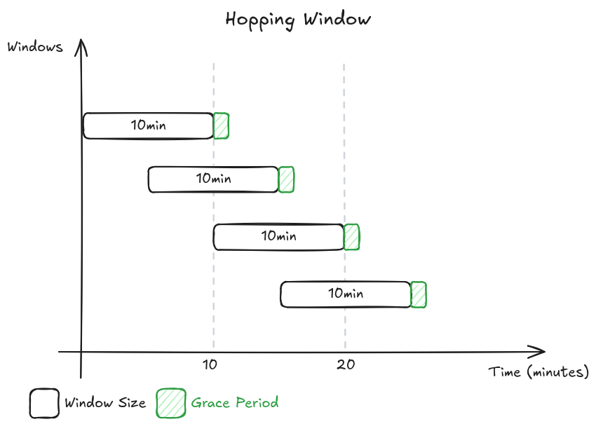
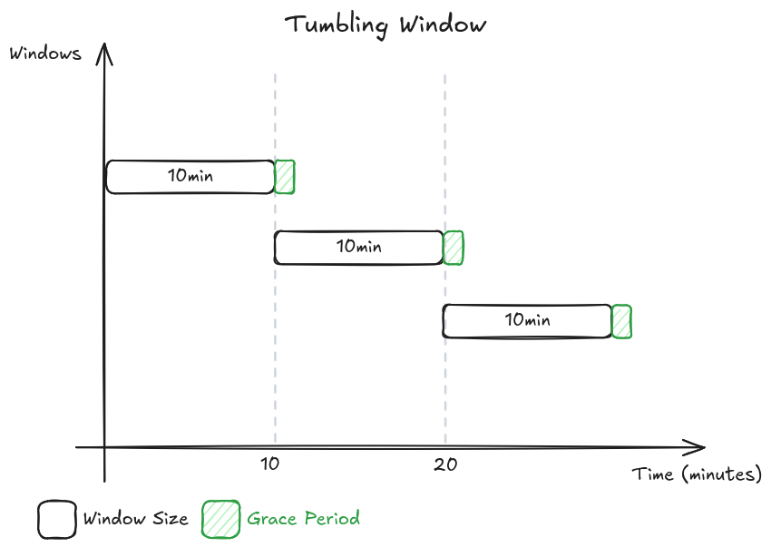
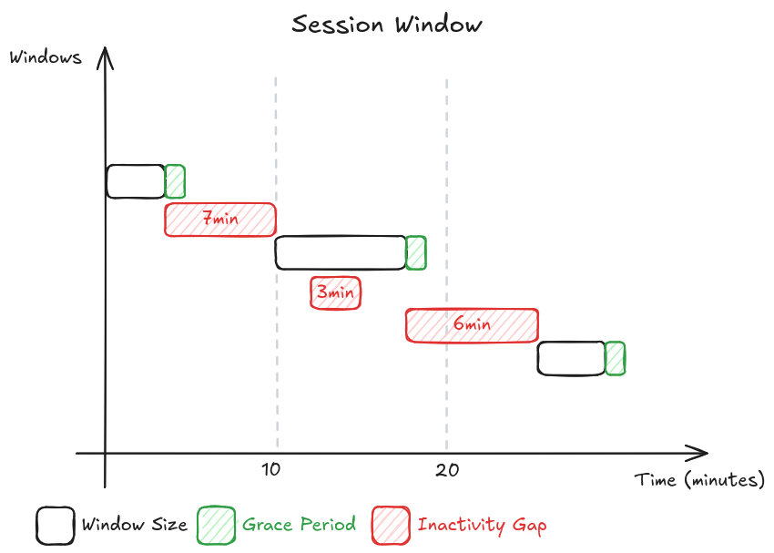
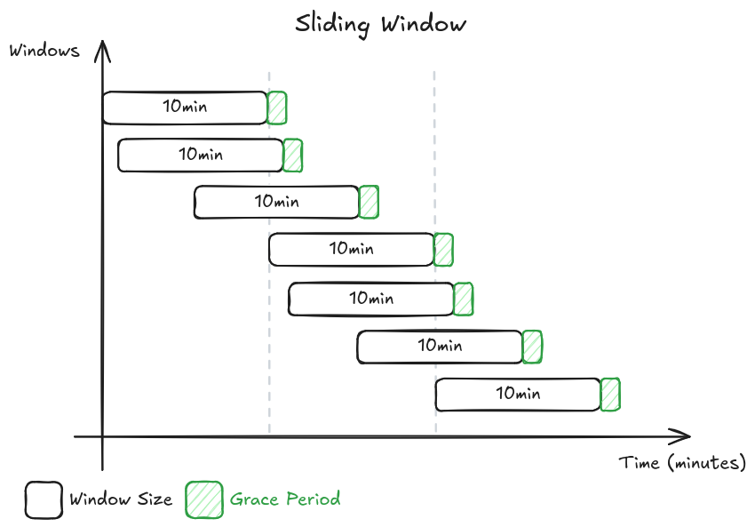

<br>

<div align="center">


<h1>Kafka Streams</h1>

</div>

## Index
1. [Serialization](#serialization) <br>
2. [Stream Types](#stream-types) <br>
    2.1. [KStream](#kstream) <br>
    2.2. [KTable](#ktable) <br>
    2.3. [GlobalKTable](#globalktable) <br>
3. [Basic Stream operations](#basic-stream-operations) <br>
    3.1. [Stateless](#stateless) <br>
    3.2. [Stateful](#stateful) <br>
4. [Windowing](#windowing) <br>
    4.1. [Hopping Window](#hopping-window) <br>
    4.2. [Tumbling Window](#tumbling-window) <br>
    4.3. [Session Window](#session-window) <br>
    4.4. [Sliding Window](#sliding-window) <br>
5. [Join](#join) <br>
    5.1. [Stream-Stream Join](#stream-stream-join) <br>
    5.2. [Stream-Table Join](#stream-table-join) <br>
    5.3. [Table-Table Join](#table-table-join) <br>
6. [Spring/Quarkus integration](#springquarkus-integration) <br>

## Serialization

The entire Kafka Streams serialization are based on Serde concept. Serde means Serializer/Deserializer, thus, they are wrapper classes to abstract both Serializer and Deserializer classes from the same type to bytes.

We can use differents built-in Serdes for basic types or create a custom Serde for specific classes. All built-in Serdes can be retrieved from `Serdes` class, e.g. `Serdes.String()`.

Examples:

```java
// Basic Serdes:
Serdes.String();
Serdes.Integer();
Serdes.Boolean();
Serdes.UUID();

// Custom Serde, if using Jackson:
Serde<YourClass> customSerde = new ObjectMapperSerde<>(YourClass.class, new ObjectMapper());
```

## Stream Types

There are some stream types to use with **Kafka Streams**, each with its use cases. All streams are based on Key-Value data.

### KStream

The basic one, also known as Event Stream, represents unrelated events that might have the same key. Here, all events are stored on memory.


Example:
```java
var builder = new StreamsBuilder();
KStream<String, String> stream = builder.stream(
	"entry-topic",
	Consumed.with(Serdes.String(), Serdes.String())
);

stream.peek((key, value) -> System.out.println(key + " - " + value));

stream.to(
	"out-topic", 
	Produced.with(Serdes.String(), Serdes.String())
);
```


### KTable

Also known as Update Stream, KTable has a different semantic. Here, multiple records with the same Key are considered an update for the same event. In KTable, the events aren't entirely stored on memory, the last state of an event is stored on disk using **RocksDB** instead.


The events are not automatically forwarded, they are cached instead. By default, the events are only commited every 30 seconds, or when it reaches 10 MB on cache.

Example:
```java
var builder = new StreamsBuilder();
KTable<String, String> table = builder.table(
	"entry-topic",
	Consumed.with(Serdes.String(), Serdes.String())
);

table.peek((key, value) -> System.out.println(key + " - " + value));

table.toStream();

table.to(
	"out-topic", 
	Produced.with(Serdes.String(), Serdes.String())
);
```


### GlobalKTable

This stream is a special kind of Table that consumes all partitions at the same time. It's a good choice for static data or small and predictable data flow.

Example:
```java
var builder = new StreamsBuilder();
KTable<String, String> table = builder.globalTable(
	"entry-topic",
	Consumed.with(Serdes.String(), Serdes.String())
);

table.peek((key, value) -> System.out.println(key + " - " + value));

table.toStream();

table.to(
	"out-topic", 
	Produced.with(Serdes.String(), Serdes.String())
);
```

---
## Basic Stream Operations

The stream operations are separated into two categories, Stateless and Stateful. The Stateless includes basic operations that doesn't need past record state or any stored data. On the other hand, Stateful operations need the past event state. 

### Stateless

- `mapValues`: Transforms only the value from Key/Value pair. It's recommended for ordinary flows.
- `map`: Transforms both Key and Value from the record.
- `filter`: Applies a conditional filter.
- `toStream`: Converts current data to KStream.
- `to`: Forwards the event to some topic.

### Stateful

- `count`: Calculates how many messages have already been forwarded.
- `reduce`: Applies a reduce function to the entire stream, returning the same type.
- `aggregate`: It's like reduce, but can handle different types for input and output. Thus, we need to specify an initializer and Serde for key/value output instead of only the reduce function.

The stateful operations just make sense if the events are grouped, for instance, by Key. Thus, we need to use `groubByKey` or a custom `groupBy` method to group the events before applying any stateful operations.

Examples:

```java
var builder = new StreamsBuilder();

KStream textStream = builder.stream(
        "text-topic",
        Consumed.with(Serdes.String(), Serdes.String())
);

stream.mapValues((key, value) -> value.toUpperCase()) // Transform text to uppercase
    .peek((key, value) -> System.out.println(value))

    .filter((key, value) -> value.length() > 10) // Get only text with 10+ characters

    .groupByKey()
    
    .aggregate(
            () -> 0L, // Initializer for default value
            (key, value, accumulator) -> accumulator + value.length(), // The reduce function
            Materialized.with(Serdes.String(), Serdes.Integer())
    )
    
    .toStream()
    
    .to("character-count-topic", Produced.with(Serdes.String(), Serdes.Integer()));


```

If your events have not been sent with a Key, you can set a custom `groupBy` like this:

```java
stream.groupBy(
        (key, value) -> value.youCustomId(),
        Grouped.with(Serdes.String(), Serdes.String())
);
```

---
## Windowing

We don't always want to read all the stream history on stateful operations. In those cases, we can use windowing to read only a time window from the stream. There are four types of windows with different approaches, being full time-based or even based on data flow.

All windows have `size` (fixed or not) and a `grace period`. Grace period is the extra time to some late event enter its window by timestamp. For example, an event has been created at 12pm, but for some reason, like network connection, just arrived at 12:05pm, and the window closes at 12:01pm. Without a configured grace period that event would be lost.

Every event is going to be forwarded downstream everytime the window is updated. If you want a single output by window, consider using `suppress()` after the aggregation, for example:

```java
yourStream.aggregate(...)
    .suppress(Suppressed.untilWindowCloses(Suppressed.BufferConfig.unbounded()))
```

### Hopping Window




Hopping Window is a semantic kind of `TimeWindows`, representing a window at which advance value is less than size, then, the same event can be on multiple windows.

With `TimeWindows` class we can set three duration values: `size`, `grace` and `advance`. The advance value represents the interval at which a new window is created.

Example:

```java
var builder = new StreamsBuilder();

KStream<String, Integer> stream = builder.stream(
        "numbers-topic",
        Consumed.with(Serdes.String(), Serdes.Integer())
);

var windowSize = Duration.ofMinutes(10);
var graceTime = Duration.ofMinutes(1);
var advanceTime = Duration.ofMinutes(5);

var timeWindows = TimeWindows
        .ofSizeAndGrace(windowSize, graceTime)
        .advanceBy(advanceTime);

stream.groupByKey()
    .windowed(timeWindows);

    .aggregate(
            () -> 0L,
            (key, value, accumulator) -> accumulator + value,
            Materialized.with(Serdes.String(), Serdes.Integer())
    )

    .supress(untilWindowCloses(unbounded()))
        
    .toStream()

    .map((windowedKey, value) -> {
            return new KeyValue<>(windowedKey.key(), value);
    })

    .to("numbers-sum-topic", Produced.with(Serdes.String(), Serdes.Integer()))
```

### Tumbling Window



Tumbling window is a subtype of Hopping Window, but, with the `size` exactly equals to `advance` time. The records won't repeat on multiple windows, then, it's useful when you need unique events. 

Example:

```java
var builder = new StreamsBuilder();

KStream<String, Integer> stream = builder.stream(
        "numbers-topic",
        Consumed.with(Serdes.String(), Serdes.Integer())
);

var windowSize = Duration.ofMinutes(10);
var graceTime = Duration.ofMinutes(1);

var timeWindows = TimeWindows.ofSizeAndGrace(windowSize, graceTime).advanceBy();

stream.groupByKey()
    .windowed(timeWindows)

    .count() // Counts events from the last 10 minutes

    .supress(untilWindowCloses(unbounded()))

    .toStream()

    .map((windowedKey, value) -> {
            return new KeyValue<>(windowedKey.key(), value);
    })

    .to("numbers-sum-topic", Produced.with(Serdes.String(), Serdes.Integer()))
```


### Session Window



Session window is a type of window that groups events by nearby timestamps, without size limit. Here, the windows are sliced when the `inactivity gap` duration is exceeded, meaning that events stop arriving within the configured gap. It's very useful to analyze user sessions.

Example:

```java
var builder = new StreamsBuilder();

KStream<String, Integer> stream = builder.stream(
        "numbers-topic",
        Consumed.with(Serdes.String(), Serdes.Integer())
);

var inactivityGap = Duration.ofMinutes(10);
var graceTime = Duration.ofMinutes(1);

var sessionWindow = SessionWindow
        .ofInactivityGapAndGrace(inactivityGap, graceTime);

stream.groupByKey()
    .windowed(sessionWindow);

    .aggregate(
            () -> 0L,
            (key, value, accumulator) -> accumulator + value,
            Materialized.with(Serdes.String(), Serdes.Integer())
    )

    .supress(untilWindowCloses(unbounded()))

    .toStream()

    .map((windowedKey, value) -> {
            return new KeyValue<>(windowedKey.key(), value);
    })

    .to("numbers-sum-topic", Produced.with(Serdes.String(), Serdes.Integer()))
```

### Sliding Window



Sliding windows have a fixed size and an undefined advance time, thus, the advance is driven by the events themselves. For each event, a new window is created and downstream operations are applied.

Example:

```java
var builder = new StreamsBuilder();

KStream<String, Integer> stream = builder.stream(
        "numbers-topic",
        Consumed.with(Serdes.String(), Serdes.Integer())
);

var timeDifference = Duration.ofMinutes(10);
var graceTime = Duration.ofMinutes(1);

var slidingWindow = TimeWindows.ofTimeDifferenceAndGrace(timeDifference, graceTime).advanceBy();

stream.groupByKey()
    .windowed(timeWindows);
    
    .reduce((value1, value2) -> value1 + value2) // Sum values from last 10 minutes

    .toStream()
        
    .peek((windowedKey, value) -> System.out.println("Sum: " + value));
```

---
## Join


A join is a Stream operation with immutable Keys that merges two streams/tables, using related keys, into a single output. There are three types of Join: Stream-Stream, Stream-Table and Table-Table. Each type of Join can support some of these operations:

- **Inner Join**: Only if both sides are available.

| Left has value | Right has value | Joined |
|----------------|-----------------|--------|
| False          | False           | False  |
| False          | True            | False  |
| True           | False           | False  |
| True           | True            | True   |


- **Outer Join**: Both sides always produce a new merge, joining the nullable side.

| Left has value | Right has value | Joined |
|----------------|-----------------|--------|
| False          | False           | False  |
| False          | True            | True   |
| True           | False           | True   |
| True           | True            | True   |

- **Left Outer Join**: The left side always produces a new merge, joining the nullable right side.

| Left has value | Right has value | Joined |
|----------------|-----------------|--------|
| False          | False           | False  |
| False          | True            | False  |
| True           | False           | True   |
| True           | True            | True   |

Let's go ahead and explore each of them.

### Stream-Stream Join

It merges two KStream into a single KStream, supporting **Inner Join**, **Outer Join** and **Left Outer Join**. Both Key and Time Window needs to be related.

Join Examples:
```java
var builder = new StreamsBuilder();

KStream<String, String> leftStream = builder.stream(
	"left-stream",
	Consumed.with(Serdes.String(), Serdes.String())
);
KStream<String, String> rightStream = builder.stream(
	"right-stream",
	Consumed.with(Serdes.String(), Serdes.String())
);

ValueJoiner<String, String, String> joiner = (leftValue, rightValue) -> leftValue + "-" + rightValue;

KStream<String, String> innerStream = leftStream.join(
	rightStream,
	joiner,
	JoinWindows.of(Duration.ofSeconds(10)),
	StreamJoined.with(Serdes.String(), Serder.String(), Serdes.String())
);

KStream<String, String> leftOuterStream = leftStream.outerJoin(
	rightStream,
	joiner,
	JoinWindows.of(Duration.ofSeconds(10)),
	StreamJoined.with(Serdes.String(), Serder.String(), Serdes.String())
);

KStream<String, String> leftOuterStream = leftStream.leftJoin(
	rightStream,
	joiner,
	JoinWindows.of(Duration.ofSeconds(10)),
	StreamJoined.with(Serdes.String(), Serder.String(), Serdes.String())
);
```

### Stream-Table Join

It merges one KStream and one KTable (without time window) into a single KStream, supporting **Inner Join** and **Left Outer Join**.

Join examples:
```java
var builder = new StreamsBuilder();

KStream<String, String> leftStream = builder.stream(
	"left-stream",
	Consumed.with(Serdes.String(), Serdes.String())
);
KTable<String, String> rightTable = builder.table(
	"right-stream",
	Materialized.with(Serdes.String(), Serdes.String())
);

ValueJoiner<String, String, String> joiner = (leftValue, rightValue) -> leftValue + "-" + rightValue;

KStream<String, String> innerStream = leftStream.join(
	rightTable,
	joiner,
	Joined.with(Serdes.String(), Serder.String(), Serdes.String())
);

KStream<String, String> leftOuterStream = leftStream.leftJoin(
	rightTable,
	joiner,
	Joined.with(Serdes.String(), Serder.String(), Serdes.String())
);
```


### Table-Table Join

It merges two KTable into one KTable (without Time Window), supporting **Inner Join**, **Outer Join** and **Left Outer Join**.

```java
var builder = new StreamsBuilder();

KTable<String, String> leftTable = builder.table(
	"left-stream",
	Materialized.with(Serdes.String(), Serdes.String())
);
KTable<String, String> rightTable = builder.table(
	"right-stream",
	Materialized.with(Serdes.String(), Serdes.String())
);

ValueJoiner<String, String, String> joiner = (leftValue, rightValue) -> leftValue + "-" + rightValue;

KTable<String, String> innerTable = leftTable.join(
	rightTable,
	joiner
);

KTable<String, String> leftOuterTable = leftTable.outerJoin(
	rightTable,
	joiner
);

KTable<String, String> leftOuterTable = leftTable.leftJoin(
	rightTable,
	joiner
);
```

---

## Spring/Quarkus integration

You can see the same example project implementing Kafka Streams using Spring Boot or Quarkus:

- [Spring Boot project](https://github.com/filipemartinsdev/spring-kafka-sandbox)
- [Quarkus project](https://github.com/filipemartinsdev/quarkus-kafka-sandbox)

---
<div align="center">

Made with ☕ by **Filipe Martins**

</div>